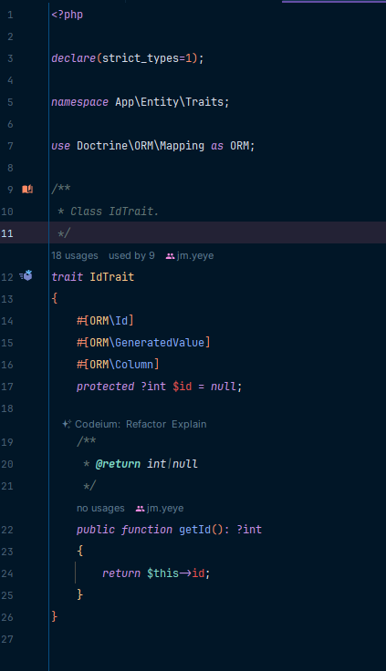
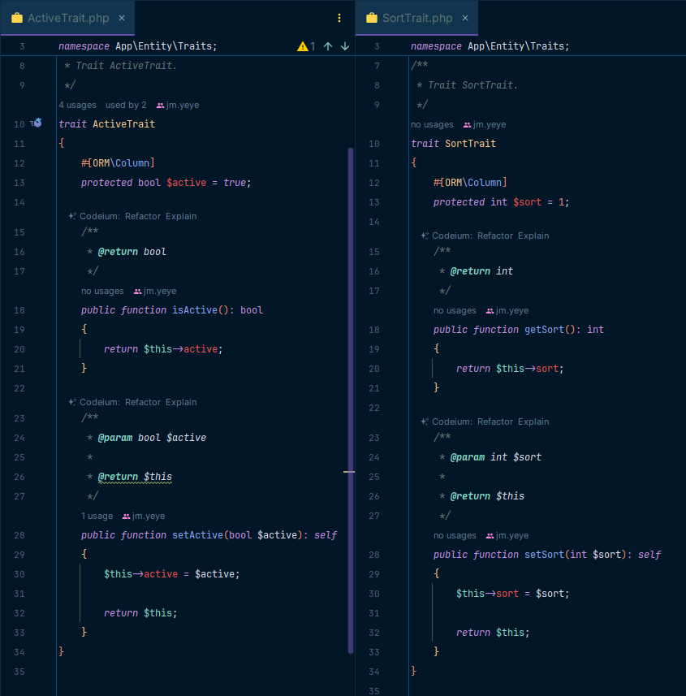
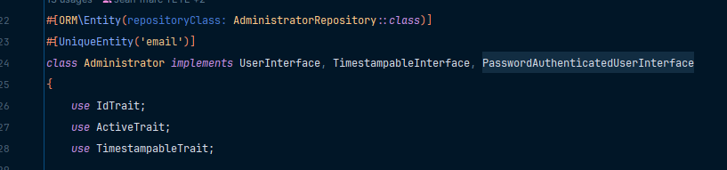
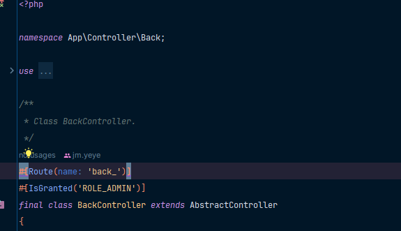

# Jour-5&amp;6 -- Premières entités, test, login admin

## Premières entités
Rien de dépaysant, la grosse nouveauté : les Traits.

### Qu'est-ce que c'est ?
Une sorte d'outil très pratique qui permet de regrouper des propriétés et des methods communes à plusieurs classes.  
Exemple : la propriété id de l'entité : la propriété id d'une entité est une valeur unique et est généré de la même façon par plusieurs entités.  
Du coup, il peut être intéressant de créer un trait pour cette propriété et les method associées pour pouvoir les réutiliser dans les autres entités.
### Comment l'utiliser
Créer un fichier IdTrait.php dans src\Entity\Traits
  
l3 : PM : déclare le typage strict sur le fichier : oblige à typer les fonctions et les paramètres de fonctions.

l14 à 17 : comme l'attribut fait partie de l'entité, on lui précise les annotations relatives à Doctrine. L'attribut est déclaré 'protected'.

l22 : On peu ajouter des method au trait. Ici on ajoute le getter associé à l'attribut id.



Pour appeler un trait, il suffit de l'appeler dans la class que l'on souhaite :



À partir de ce moment, les propriétés et methods du trait sont accéssible dans l'entité.  
Il n'est pas nécessaire de les déclarer dans l'entité.  
On peut, si besoin, surcharger les méthods du trait et les déclarer dans l'entité.  
Deux possibilités : soit la method est totalement réimplémentée, soit on la fait hériter (parent::methodDeTrait) du trait 
et la complèter avec une logique spécifique à l'entité.  
Si une class hérite d'une autre class et qu'elle utilise un trait qui contient une method qui porte le même nom qu'une 
method hérité de la class mère, la method du trait écrase la method héritée.  
On peut utiliser autant de trait que nécessaire dans une class.

## Tester une Entité
### Pourquoi?  
S'assurer que les contraintes de validation soient bien prisent en compte.  
### Comment?
Utiliser la commande symfony `make:test` pour créer un nouveau test.  
S'assurer que la class créée `extends` bien la class `KernelTestCase`.  

Dans un premier temps on créée une fonction qui va nous permettre de créer une entité avec les propriétés que l'on veut tester etqui nous servira dans tous les tests.  
```PHP
public function getEntity(): Administrator
    {
        return (new Administrator())
            ->setFirstName('testFirstName')
            ->setLastName('testLastName')
            ->setEmail('testEmail@test.com')
            ->setPassword('P@ssw0rd123!Strong');
    }
```

Ensuite on va créer la fonction qui va nous permettre de tester les propriétés.  
```PHP
public function assertHasErrors(Administrator $administrator, int $number = 0): void
    {
        self::bootKernel();
        /** @var ValidatorInterface $validator */
        $validator = $this->getContainer()->get('validator');
        $errors = $validator->validate($administrator);
        $messages = [];
        /** @var ConstraintViolation $error */
        foreach ($errors as $error) {
            $messages[] = $error->getPropertyPath().' => '.$error->getMessage();
        }
        $this->assertCount($number, $errors, implode(', ', $messages));
    }
```
Cette fonction va prendre en paramètre une entité (ici `Adminitrator`) et un Integer qui nous permettera d'indiquer le nombre d'erreurs que l'on attend.  

À l'intérieur, on commence par instancier le Kernel.  
On récupère le validator du Kernel puis on s'en sert dans en appelant la fonction validate() en lui passant en paramètre l'entité. Les erreurs retournées sous forme de tableau son stocké dans la variable `$errors`.
À partir de là, l'entité vien d'être testé et nous a renvoyé les erreurs.  
Pour les afficher, on va créer une variable message qui nous servira à récupérer les messages d'erreurs dans un tableau.


## Login Admin
Une fois notre entité administrator nous pouvons mettre en place le login qui permettera à un utilisateur de se connecter.  
Cela permettera également de mettre en place la sécurité au fur et a mesure de l'avancement du projet : nouvelle page->qui peu y avoir accès ?  
Symfony facilite le travail et nous propose une commande `make:auth` pour créer ce login.  
Cette commande va créer :  
`created: src/Security/AppAuthenticator.php`  
c'est dans cette class que l'on retrouve les méthod qui permettent d'autentifier un utilisateur.  
`updated: config/packages/security.yaml`  
Mise à jour du fichier pour indiquer le service à appeler pour la route de logout.
`created: src/Controller/SecurityController.php`  
Retourne le formulaire de login ou le logout
`created: templates/security/login.html.twig`  
Le template HTML de la page de login.

À partir de là, on peu commencer à configurer le tout.

On indique les routes du login et du logout dans le fichier routes.yaml :
```yaml
app_login:
    path: /login
    controller: App\Controller\SecurityController::login

app_logout:
    path: /logout
    controller: App\Controller\SecurityController::logout
```
On précise la redirection souhaitée apres authentification réussie dans le AppAuthenticator dans ` public function onAuthenticationSuccess` :

```PHP
 return new RedirectResponse($this->urlGenerator->generate('back_index'));
```
On met en place la page de login 


Ensuite, on détermine dans les controlers quels rôles y ont accès avec l'annotation `#[IsGranted('MON_RÔLE')]` soit avant la class, soit au-dessus des methods :  

Dans l'exemple, l'intégralité du controleur sera restraint aux utilisateurs ayant le role `ROLE_ADMIN`.