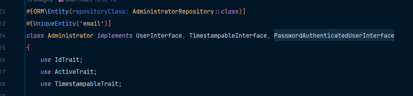

# Jour-5&amp;6 -- Premières entités, test, login admin

## Premières entités
Rien de dépaysant, la grosse nouveauté : les Traits.

### Qu'est-ce que c'est ?
Une sorte d'outil très pratique qui permet de regrouper des propriétés et des methods communes à plusieurs classes.  
Exemple : la propriété id de l'entité : la propriété id d'une entité est une valeur unique et est généré de la même façon par plusieurs entités.  
Du coup, il peut être intéressant de créer un trait pour cette propriété et les method associées pour pouvoir les réutiliser dans les autres entités.
### Comment l'utiliser
Créer un fichier IdTrait.php dans src\Entity\Traits
  
l3 : PM : déclare le typage strict sur le fichier : oblige à typer les fonctions et les paramètres de fonctions.

l14 à 17 : comme l'attribut fait partie de l'entité, on lui précise les annotations relatives à Doctrine. L'attribut est déclaré 'protected'.

l22 : On peu ajouter des method au trait. Ici on ajoute le getter associé à l'attribut id.

Pour appeler un trait, il suffit de l'appeler dans la class que l'on souhaite :

À partir de ce moment, les propriétés et methods du trait sont accéssible dans l'entité.  
Il n'est pas nécessaire de les déclarer dans l'entité.  
On peut, si besoin, surcharger les méthods du trait et les déclarer dans l'entité.  
Deux possibilités : soit la method est totalement réimplémentée, soit on la fait hériter (parent::methodDeTrait) du trait 
et la complèter avec une logique spécifique à l'entité.  
Si une class hérite d'une autre class et qu'elle utilise un trait qui contient une method qui porte le même nom qu'une 
method hérité de la class mère, la method du trait écrase la method héritée.  
On peut utiliser autant de trait que nécessaire dans une class.

## Tester une Entité
Pourquoi? s'assurer que les contraintes soient bien prisent en compte.

## Login Admin

## installation de flowbite (librairie de composant pour TailWind)